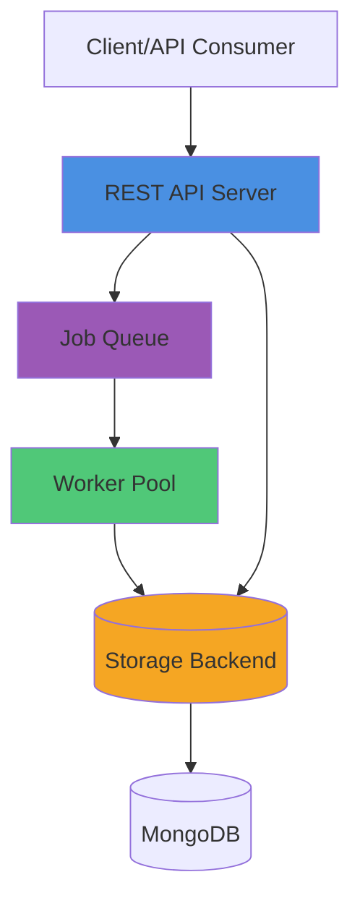
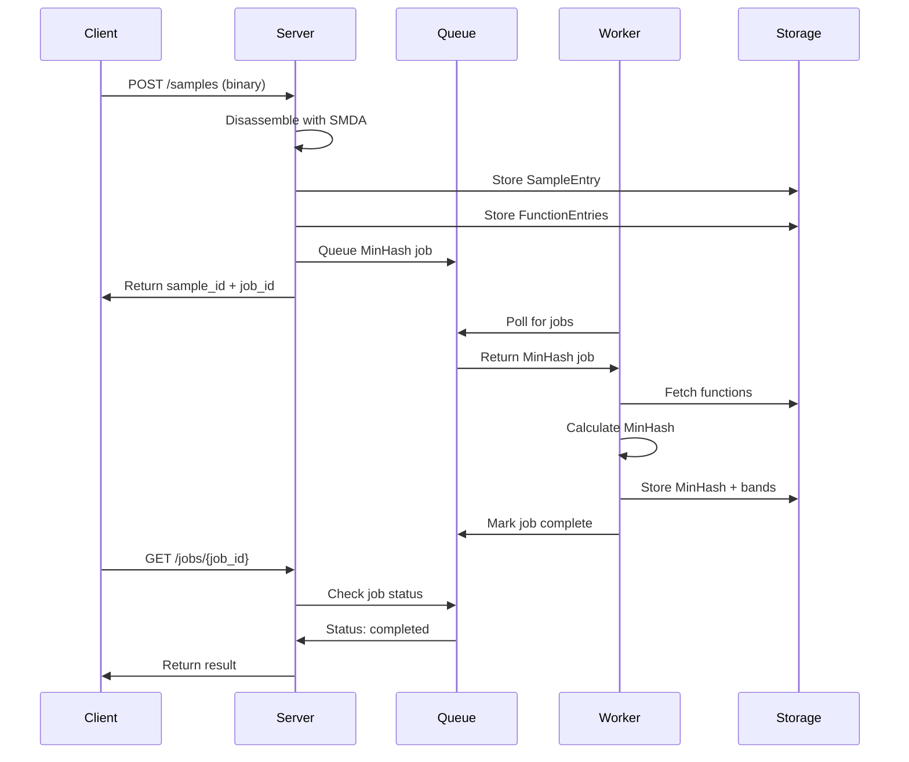
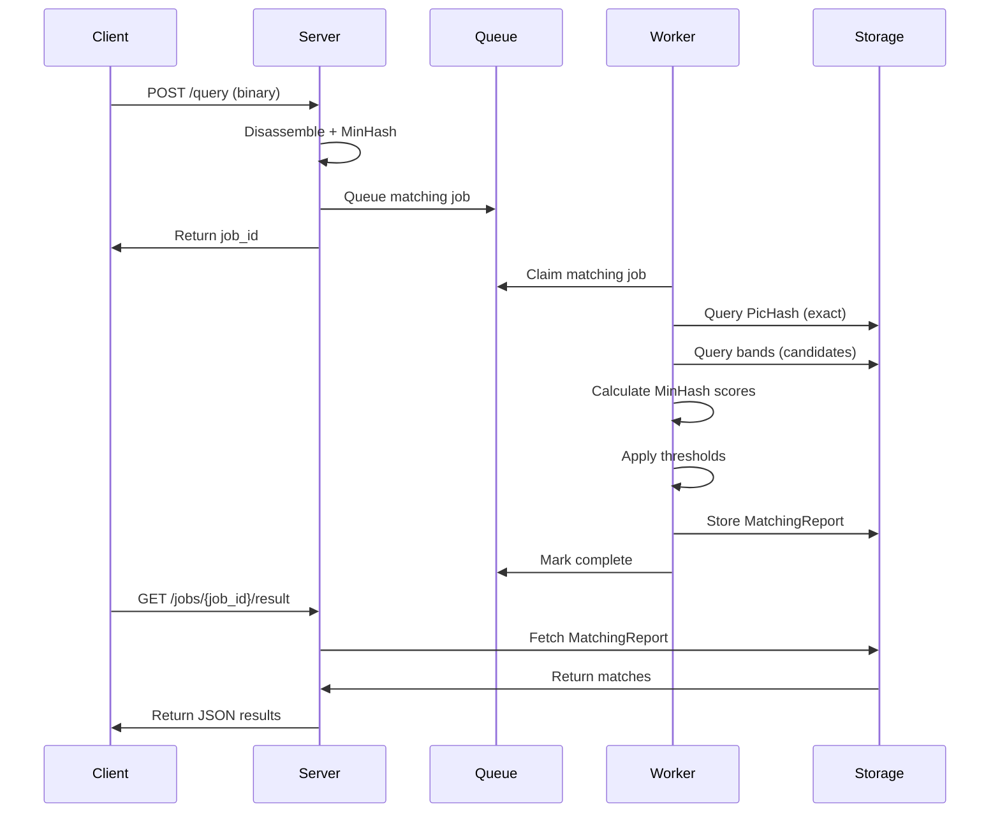

## Overview

MCRIT is a distributed system designed for scalable binary code similarity analysis. It consists of four main components that work together to process, index, and query binary code.

## Core Components



### 1. REST API Server

**Purpose**: HTTP interface for client interactions

**Implementation**: `mcrit/server/`

**Framework**: Falcon (WSGI)

The server provides RESTful endpoints organized by resource type:

```python
# From application_routes.py
def get_app():
    index = MinHashIndex()
    
    # Resource handlers
    status_resource = StatusResource(index)
    family_resource = FamilyResource(index)
    sample_resource = SampleResource(index)
    function_resource = FunctionResource(index)
    match_resource = MatchResource(index)
    query_resource = QueryResource(index)
    job_resource = JobResource(index)
    
    app = falcon.App()
    app.add_route("/status", status_resource)
    app.add_route("/samples", sample_resource)
    app.add_route("/matches/sample/{sample_id:int}", match_resource)
    # ... more routes
```

#### Key Resource Modules

- **StatusResource.py**: System status, configuration, export/import
- **SampleResource.py**: Sample submission, retrieval, modification
- **FamilyResource.py**: Malware family management
- **FunctionResource.py**: Function-level queries
- **MatchResource.py**: Similarity matching results
- **QueryResource.py**: Binary/function matching queries
- **JobResource.py**: Asynchronous job management

### 2. Worker

**Purpose**: Executes long-running analysis jobs

**Implementation**: `mcrit/Worker.py`

**Process Model**: Multi-process pool

Workers handle computationally intensive tasks:

```python
class Worker(QueueRemoteCallee):
    def __init__(self, queue=None, config=None, storage=None, profiling=False):
        self._worker_id = f"Worker-{uuid.uuid4()}"
        self.config = config
        self.minhasher = MinHasher(config.MINHASH_CONFIG, config.SHINGLER_CONFIG)
        self._storage = StorageFactory.getStorage(config)
        super().__init__(queue, profiling_path)
```

#### Worker Responsibilities

1. **MinHash Calculation**: Generate MinHash signatures for functions
2. **Matching Jobs**: Perform similarity comparisons
3. **Index Rebuilding**: Reconstruct band indexes
4. **PicHash Recalculation**: Update position-independent hashes
5. **Cross Matching**: Compare multiple samples

#### Worker Types

- **Worker.py**: Full-featured worker with all capabilities
- **SpawningWorker.py**: Creates child worker processes
- **SingleJobWorker.py**: Executes one job then exits

### 3. Storage Backend

**Purpose**: Persistent data storage and indexing

**Implementation**: `mcrit/storage/`

**Primary Backend**: MongoDB

#### Storage Schema

```python
# Key data structures
class FunctionEntry:
    function_id: int
    family_id: int
    sample_id: int
    minhash: bytes  # MinHash signature
    pichash: int    # Position-independent hash
    picblockhashes: list
    offset: int
    num_instructions: int
    num_blocks: int
    xcfg: Dict  # Control flow graph

class SampleEntry:
    sample_id: int
    family_id: int
    sha256: str
    filename: str
    architecture: str
    is_library: bool
    statistics: Dict

class FamilyEntry:
    family_id: int
    family_name: str
    num_samples: int
    num_functions: int
```

#### Storage Indices

MongoDB maintains several indexes for performance:

1. **PicHash Index**: Fast exact function lookup
2. **Band Indexes**: LSH bands for MinHash matching
3. **Sample SHA256 Index**: Deduplication
4. **Family ID Index**: Family-based queries
5. **Function ID Index**: Direct function access

### 4. Queue System

**Purpose**: Job distribution and coordination

**Implementation**: `mcrit/queue/`

**Backend**: MongoDB-based queue (mongoqueue)

The queue manages asynchronous job execution:

```python
class LocalQueue:
    def put(self, job: Job):
        """Add job to queue"""
        
    def get(self, worker_id: str) -> Job:
        """Worker claims next job"""
        
    def complete(self, job_id: str, result: dict):
        """Mark job finished with result"""
        
    def fail(self, job_id: str, error: str):
        """Mark job failed with error"""
```

#### Job Types

From `queue/LocalQueue.py`:

- **updateMinHashes**: Calculate MinHash for functions
- **getMatchesForSample**: Find matches for sample
- **getMatchesForSmdaReport**: Match query binary
- **rebuildIndex**: Reconstruct MinHash bands
- **recalculatePicHashes**: Update PicHash values
- **deleteSample**: Remove sample and functions
- **combineMatchesToCross**: Aggregate cross-matching results

## Data Flow

### Sample Submission Flow



### Matching Flow



## Component Interaction

### MinHashIndex

**Central coordinator**: `mcrit/index/MinHashIndex.py`

```python
class MinHashIndex(QueueRemoteCaller(Worker)):
    def __init__(self, config=None):
        self.config = config
        self.minhasher = MinHasher(config.MINHASH_CONFIG, config.SHINGLER_CONFIG)
        self._storage = StorageFactory.getStorage(config)
        queue = QueueFactory().getQueue(config)
        super().__init__(queue)
```

**Role**: Bridge between Server and Worker

- **Synchronous operations**: Direct storage queries (lookups, search)
- **Asynchronous operations**: Queue jobs for workers (matching, indexing)

### QueueRemoteCalls

From `mcrit/queue/QueueRemoteCalls.py`:

Enables RPC-style communication through the queue:

```python
class QueueRemoteCaller:
    """Client side - submits jobs"""
    def __getattr__(self, name):
        def remote_call(*args, **kwargs):
            job_id = self.queue.put(Job(name, args, kwargs))
            return job_id
        return remote_call

class QueueRemoteCallee:
    """Server side - executes jobs"""
    def run(self):
        while True:
            job = self.queue.get(self._worker_id)
            method = getattr(self, job.method)
            result = method(*job.args, **job.kwargs)
            self.queue.complete(job.id, result)
```

This pattern allows the Server to call Worker methods asynchronously through the queue.

## Deployment Topologies

### Single-Node Deployment

```
┌─────────────────────────────┐
│     Single Server           │
│                             │
│  ┌──────┐  ┌──────┐        │
│  │Server│  │Worker│        │
│  └───┬──┘  └───┬──┘        │
│      │         │            │
│      └────┬────┘            │
│           │                 │
│      ┌────▼────┐            │
│      │ MongoDB │            │
│      └─────────┘            │
└─────────────────────────────┘
```

**Use case**: Development, small datasets

### Distributed Deployment

```
┌────────────┐     ┌────────────┐
│  Server 1  │     │  Server 2  │
└─────┬──────┘     └─────┬──────┘
      │                  │
      └──────┬───────────┘
             │
    ┌────────▼────────┐
    │   MongoDB       │
    │  (Queue+Storage)│
    └────────┬────────┘
             │
      ┌──────┴──────┐
      │             │
┌─────▼───┐   ┌────▼────┐
│Worker 1 │   │Worker 2 │
└─────────┘   └─────────┘
```

**Use case**: Production, large datasets

**Benefits**:
- Horizontal scaling of workers
- Load balancing across servers
- Fault tolerance (worker failures)

## Configuration

### McritConfig

Master configuration from `config/McritConfig.py`:

```python
class McritConfig:
    VERSION = "1.0.0"
    
    # Sub-configurations
    MINHASH_CONFIG = MinHashConfig()
    SHINGLER_CONFIG = ShinglerConfig()
    STORAGE_CONFIG = StorageConfig()
    QUEUE_CONFIG = QueueConfig()
    
    # Server settings
    SERVER_HOST = "0.0.0.0"
    SERVER_PORT = 8000
    AUTH_TOKEN = None  # Optional API authentication
```

### Storage Configuration

```python
class StorageConfig:
    STORAGE_METHOD = "mongodb"  # Primary backend
    STORAGE_MONGODB_HOST = "localhost"
    STORAGE_MONGODB_PORT = 27017
    STORAGE_MONGODB_DBNAME = "mcrit"
    STORAGE_MONGODB_ENABLE_CLEANUP = True
    STORAGE_MONGODB_CLEANUP_DELTA = 3600  # 1 hour
```

### Queue Configuration

```python
class QueueConfig:
    QUEUE_METHOD = "mongodb"  # Use MongoDB as queue backend
    QUEUE_MONGODB_COLLECTION = "queue"
    QUEUE_WORKER_POOL_SIZE = 4  # Number of worker processes
```

## Process Lifecycle

### Server Startup

1. Load configuration from environment/files
2. Initialize MinHashIndex (connects to storage + queue)
3. Create Falcon app with resource routes
4. Start WSGI server (Gunicorn in production)
5. Begin accepting HTTP requests

### Worker Startup

1. Load configuration
2. Connect to queue with unique worker_id
3. Initialize MinHasher with shingler configuration
4. Connect to storage backend
5. Enter job polling loop

### Job Execution

1. Worker polls queue
2. Queue returns next pending job (atomically claims)
3. Worker deserializes job parameters
4. Worker executes method with parameters
5. Worker stores result in storage
6. Worker marks job complete in queue
7. Repeat

### Graceful Shutdown

```python
def __exit__(self, *args):
    # Unregister worker from all in-progress jobs
    self.queue.unregisterWorker()
    # Release claimed jobs back to queue
    self.queue.release_all_jobs()
```

## Monitoring and Management

### Status Endpoint

```bash
curl http://localhost:8000/status
```

```json
{
  "status": {
    "db_state": "ready",
    "storage_type": "mongodb",
    "num_bands": 128,
    "num_samples": 1234,
    "num_families": 56,
    "num_functions": 98765,
    "num_pichashes": 87654
  }
}
```

### Job Statistics

```bash
curl http://localhost:8000/jobs/stats
```

```json
{
  "pending": 5,
  "in_progress": 2,
  "completed": 1000,
  "failed": 3
}
```

### Database Maintenance

```bash
# Rebuild MinHash band index
curl -X POST http://localhost:8000/rebuild_index

# Recalculate all PicHashes (e.g., after SMDA update)
curl -X POST http://localhost:8000/recalculate_pichashes

# Complete missing MinHashes
curl -X POST http://localhost:8000/complete_minhashes
```

## Performance Considerations

### Bottlenecks

1. **MinHash Calculation**: CPU-bound, benefits from worker scaling
2. **Band Index Queries**: I/O-bound, benefits from MongoDB indexes
3. **Job Queue Throughput**: Limited by MongoDB atomic operations
4. **Network**: In distributed setups, worker-storage latency matters

### Scaling Strategies

**Vertical Scaling**:
- More worker processes per node
- Larger MongoDB instance
- SSD storage for database

**Horizontal Scaling**:
- Multiple worker nodes
- MongoDB replica set
- Load-balanced server endpoints

### Caching

MCRIT caches:
- **MinHash band candidates**: Reduce repeated band queries
- **PicHash lookups**: In-memory cache for frequent queries
- **Job results**: Completed job results retained for reuse

## Security

### Authentication

```python
class AuthMiddleware:
    def process_request(self, req, resp):
        token = req.get_header('apitoken')
        if not self._token_is_valid(token):
            raise falcon.HTTPUnauthorized()
```

Enable via `McritConfig.AUTH_TOKEN`

### Network Security

- Run behind reverse proxy (nginx)
- Use TLS for external connections
- Firewall MongoDB port (27017)
- VPN for distributed workers

## Related Concepts

<CardGroup cols={2}>
  <Card title="MinHash" icon="fingerprint" href="/concepts/minhash">
    Deep dive into the MinHash algorithm and indexing
  </Card>
  
  <Card title="Shinglers" icon="puzzle-piece" href="/concepts/shinglers">
    How function features are extracted
  </Card>
  
  <Card title="API Reference" icon="code" href="/api/overview">
    Complete REST API documentation
  </Card>
  
  <Card title="Deployment" icon="server" href="/guides/deployment">
    Production deployment guide
  </Card>
</CardGroup>