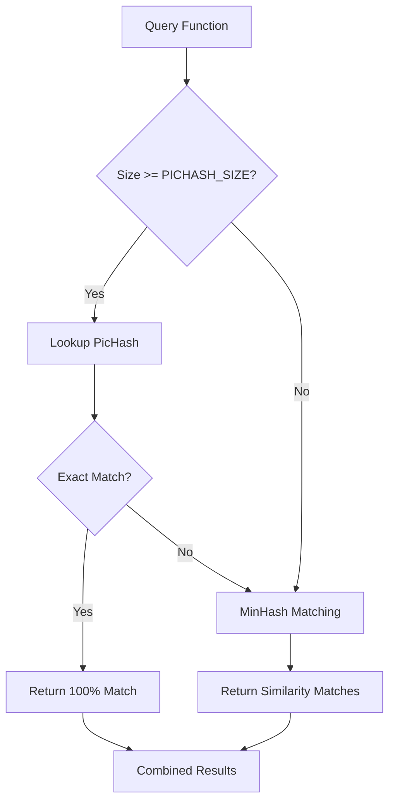

## Overview

PicHash (Position Independent Code Hash) provides exact matching for functions by creating cryptographic hashes of normalized instruction sequences. Unlike MinHash which provides fuzzy similarity, PicHash enables precise identification of identical code regardless of where it appears in memory.

## What is PicHash?

PicHash is a hash of a function's instructions after normalizing position-dependent elements like:
- Absolute addresses
- Jump targets
- Call destinations
- Memory references

Two functions with the same PicHash are semantically identical, even if compiled at different base addresses or embedded in different binaries.

## PicHash vs MinHash

| Feature | PicHash | MinHash |
|---------|---------|--------|
| **Type** | Cryptographic hash | Probabilistic signature |
| **Matching** | Exact (100%) | Similarity (0-100%) |
| **Use Case** | Identical code detection | Similar code detection |
| **Speed** | O(1) lookup | O(n) candidate filtering |
| **Storage** | 64-bit integer | 64-element array |
| **Collision** | Extremely rare | By design (feature) |

<Tip>
PicHash is perfect for identifying known library functions, code reuse, and exact duplicates across samples.
</Tip>

## PicHash in MCRIT

### Storage in FunctionEntry

From `mcrit/storage/FunctionEntry.py`:

```python
class FunctionEntry(object):
    function_id: int
    pichash: int  # 64-bit position-independent hash
    picblockhashes: list  # PicHash for each basic block
    # ... other fields
    
    def __init__(self, sample_entry, smda_function, function_id, minhash=None):
        if smda_function:
            self.pichash = smda_function.pic_hash
            self.picblockhashes = []
```

### PicHash Calculation

PicHash is calculated by SMDA (the disassembler) during function analysis. MCRIT stores and indexes these hashes but doesn't calculate them directly.

**SMDA Process**:
1. Disassemble function
2. Normalize position-dependent values
3. Concatenate normalized instruction bytes
4. Hash the result (typically using a fast hash like xxHash or similar)

## PicBlockHash

**PicBlockHash** extends the concept to individual basic blocks:

```python
picblockhashes: list  # One hash per basic block
```

### Use Cases for PicBlockHash

1. **Partial Function Matching**: Find functions sharing common code blocks
2. **Code Fragment Search**: Identify specific code patterns
3. **Granular Similarity**: Detect functions with partial overlap
4. **Unique Block Analysis**: Identify distinguishing code sections

<Note>
PicBlockHash enables matching at a finer granularity than whole functions, useful for detecting code reuse at the basic block level.
</Note>

## Querying by PicHash

MCRIT provides direct API endpoints for PicHash queries:

### Query Function by PicHash

```bash
curl http://localhost:8000/query/pichash/1234567890
```

Returns all functions with matching PicHash:

```json
{
  "matches": [
    {
      "function_id": 42,
      "sample_id": 7,
      "family_id": 2,
      "function_name": "sub_401000",
      "offset": 4198400,
      "pichash": 1234567890
    }
  ]
}
```

### Query by PicBlockHash

```bash
curl http://localhost:8000/query/picblockhash/9876543210
```

Returns functions containing a block with matching PicBlockHash:

```json
{
  "matches": [
    {
      "function_id": 42,
      "block_offset": 4198420,
      "picblockhash": 9876543210
    }
  ]
}
```

### Summary Queries

Get aggregated information without full details:

```bash
# PicHash summary
curl http://localhost:8000/query/pichash/1234567890/summary

# PicBlockHash summary  
curl http://localhost:8000/query/picblockhash/9876543210/summary
```

## Storage Implementation

From `mcrit/index/MinHashIndex.py`:

```python
def getMatchesForPicHash(self, pichash):
    return self.getStorage().getMatchesForPicHash(pichash)
    
def getMatchesForPicBlockHash(self, picblockhash):
    return self.getStorage().getMatchesForPicBlockHash(picblockhash)
```

The storage backend (MongoDB or SQL) maintains indexes on both `pichash` and `picblockhashes` fields for fast lookup.

## Configuration

PicHash behavior is controlled via `MinHashConfig.py`:

```python
# Minimum function size for PicHash matching
PICHASH_SIZE: int = 10

# Assume PicHash match implies MinHash match
PICHASH_IMPLIES_MINHASH_MATCH: bool = True
```

### PICHASH_SIZE

Functions smaller than this threshold are not indexed by PicHash. This prevents:
- Index bloat from trivial functions
- False matches on simple code patterns (e.g., `ret` only)

Default: 10 instructions

### PICHASH_IMPLIES_MINHASH_MATCH

When `True`, PicHash matches are automatically considered MinHash matches without calculating similarity score. This:
- Saves computation (no MinHash comparison needed)
- Ensures identical functions always score 100%
- Speeds up matching pipeline

<Warning>
If you set `PICHASH_IMPLIES_MINHASH_MATCH = False`, identical functions will still be compared via MinHash, which is redundant but allows verification.
</Warning>

## PicHash in Matching Pipeline

When MCRIT performs matching:

1. **PicHash Lookup**: Check for exact matches first
   ```python
   pichash_matches = storage.getMatchesForPicHash(function.pichash)
   ```

2. **MinHash Candidates**: Generate candidates via band matching
   ```python
   band_candidates = storage.getBandCandidates(function.minhash)
   ```

3. **Combined Results**: Merge PicHash and MinHash matches
   ```python
   if PICHASH_IMPLIES_MINHASH_MATCH:
       # PicHash matches get 100% score automatically
       all_matches = pichash_matches + minhash_matches
   ```



## Common Use Cases

### 1. Library Function Identification

```python
# Find all uses of a known library function
matches = index.getMatchesForPicHash(known_function.pichash)
print(f"Found in {len(matches)} samples")
```

### 2. Code Reuse Detection

```python
# Check if function exists elsewhere
for function in sample.functions:
    duplicates = index.getMatchesForPicHash(function.pichash)
    if len(duplicates) > 1:
        print(f"Function {function.offset:x} appears in {len(duplicates)} samples")
```

### 3. Unique Block Identification

```python
# Find blocks unique to a sample
for function in sample.functions:
    for picblockhash in function.picblockhashes:
        matches = index.getMatchesForPicBlockHash(picblockhash)
        if len(matches) == 1:
            print(f"Unique block at {function.offset:x}")
```

### 4. Cross-Binary Function Tracking

```python
# Track a function across versions
versions = [v1, v2, v3]
for version in versions:
    matches = index.getMatchesForPicHash(target_pichash)
    print(f"{version.filename}: {len(matches)} instances")
```

## Limitations

### Position-Dependent Code

PicHash works best for position-independent code. It may produce different hashes for:
- **Absolute addressing**: Direct memory addresses embedded in instructions
- **Self-modifying code**: Runtime instruction changes
- **Data references**: Pointers to global data

### Compiler Variations

Even identical source code can produce different PicHashes if:
- Different compilers used (MSVC vs GCC)
- Different optimization levels (-O0 vs -O3)
- Different architectures (x86 vs x64)

<Tip>
For compiler-resilient matching, use MinHash in combination with PicHash. PicHash catches exact matches, MinHash catches similar variants.
</Tip>

## Performance

### PicHash Advantages

- **O(1) lookup**: Hash table or indexed database query
- **Minimal storage**: Single 64-bit integer per function
- **No false positives**: Matches are exact (within normalization)
- **Fast indexing**: Simple to compute and store

### Scalability

PicHash scales linearly:
- **1M functions**: ~8MB for PicHash index (vs ~64MB for MinHash)
- **Query time**: Milliseconds regardless of database size
- **Index build**: Negligible (hashes provided by SMDA)

## Related Concepts

<CardGroup cols={2}>
  <Card title="MinHash" icon="fingerprint" href="/concepts/minhash">
    Learn about fuzzy similarity matching with MinHash
  </Card>
  
  <Card title="Architecture" icon="sitemap" href="/concepts/architecture">
    See how PicHash fits into the matching pipeline
  </Card>
  
  <Card title="Query API" icon="magnifying-glass" href="/api/query">
    API endpoints for PicHash queries
  </Card>
  
  <Card title="Unique Blocks" icon="cube" href="/api/blocks">
    Using PicBlockHash for unique code identification
  </Card>
</CardGroup>