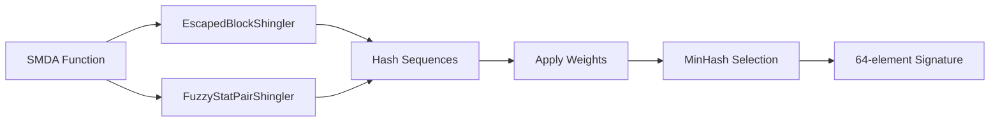

## Overview

Shinglers are feature extractors that convert binary function characteristics into hashable sequences (shingles). They form the foundation of MCRIT's similarity analysis by encoding different aspects of function behavior into comparable representations.

## What Are Shingles?

A shingle is a sequence of bytes or a structured representation of function properties that can be hashed. Multiple shinglers extract different features from the same function, providing diverse perspectives for similarity comparison.

## Abstract Shingler

All shinglers inherit from `AbstractShingler` (from `mcrit/shinglers/AbstractShingler.py`):

```python
class AbstractShingler:
    def __init__(self, plugin_name):
        self._name = plugin_name
        self._config = {}
        self._weight = 0  # Controls contribution to MinHash signature
        self._use_weights = True
    
    @abstractmethod
    def _generateByteSequences(self, function_object):
        """Generate hashable sequences from function"""
        raise NotImplementedError
    
    def process(self, function_object, hash_seed):
        """Hash the generated sequences"""
        byte_sequences = self._generateByteSequences(function_object)
        shingled_reference = [self.hashShingle(byte_sequence, hash_seed) 
                            for byte_sequence in byte_sequences]
        return shingled_sequences
```

### Shingler Weights

Each shingler has a **weight** that determines how many segments it contributes to the final MinHash signature when using the `MINHASH_STRATEGY_SEGMENTED` strategy.

For example, with a 64-element signature:
- A shingler with weight 32 contributes to 32 signature elements
- A shingler with weight 16 contributes to 16 signature elements
- Remaining elements distributed among other shinglers

## Active Shinglers

MCRIT uses two primary shinglers in production:

### EscapedBlockShingler

**Purpose**: Captures instruction sequences with operand normalization

**Location**: `mcrit/shinglers/EscapedBlockShingler.py`

**How it works**:

1. **Instruction Escaping**: Normalizes operands to ignore specific registers/addresses
   ```python
   def _escapeInstruction(self, instruction):
       return (instruction.getMnemonicGroup(IntelInstructionEscaper) + " " +
               instruction.getEscapedOperands(IntelInstructionEscaper))
   ```

2. **N-gram Creation**: Creates 3-grams of escaped instructions
   ```python
   def _maskInstructions(self, instructions, ngram_size=3):
       escaped_sequence = [self._escapeInstruction(ins) for ins in instructions]
       if len(instructions) > ngram_size:
           for index in range(len(escaped_sequence) - ngram_size + 1):
               escaped_ngram = escaped_sequence[index : index + ngram_size]
               sequences.append(";".join(sorted(escaped_ngram)))
   ```

3. **Token Relabeling**: Assigns unique identifiers to repeated n-grams
   ```python
   def _relabelNgrams(self, ngrams):
       counted_ngrams = Counter()
       for ngram in ngrams:
           counted_ngrams[ngram] += 1
           restructured.append(f"tok-{counted_ngrams[ngram]}|{ngram}")
   ```

**Example output**:
```
tok-1|A reg; M imm; S reg
tok-2|A reg; M imm; S reg
tok-1|C imm; S reg; M imm
```

<Tip>
Escaped instruction sequences make matching resilient to:
- Register allocation differences
- Immediate value changes
- Memory address variations
</Tip>

### FuzzyStatPairShingler

**Purpose**: Encodes statistical properties of functions with built-in fuzziness

**Location**: `mcrit/shinglers/FuzzyStatPairShingler.py`

**Key Features**:

1. **Log Bucketing**: Groups similar values to introduce controlled fuzziness
   ```python
   def _getLogBucketRange(self, value):
       log_value = math.log(value, 2) if value > 0 else 0
       floored_exponent = math.floor(log_value)
       window_size = 2 ** math.floor(floored_exponent / 2)
       middle_bucket = window_size * math.ceil(value / window_size)
       return (middle_bucket - window_size, middle_bucket, middle_bucket + window_size)
   ```

2. **Collected Statistics**:
   - `num_ins_C`: Count of control flow instructions
   - `num_ins_S`: Count of stack operations
   - `num_ins_A_rel`: Relative percentage of arithmetic instructions
   - `num_ins_M_rel`: Relative percentage of memory operations
   - `num_calls`: Number of function calls
   - `stack_size`: Local stack frame size
   - `max_block_size`: Size of largest basic block

3. **Centered Bucketing**: Creates multiple buckets around actual value
   ```python
   def _create_bucketed_values(self, value, field_name):
       bucket_range = self._log_buckets.getLogBucketRange(value)
       for index, bucket in enumerate(bucket_range):
           bucketed.append("{}:{}".format(field_name, bucket))
   ```

**Example output**:
```
num_ins_C:8
num_ins_C:12
num_ins_C:16
num_ins_S:4
num_calls:2
```

<Note>
Log bucketing allows functions with similar (but not identical) characteristics to match. For example, functions with 15 or 17 calls might both bucket to 16.
</Note>

## Instruction Escaping

Instruction escaping is powered by SMDA's `IntelInstructionEscaper`:

### Mnemonic Groups

Instructions are grouped into categories:
- **A**: Arithmetic (add, sub, mul, div)
- **C**: Control flow (jmp, call, ret)
- **M**: Memory operations (mov, lea, push, pop)
- **S**: Stack operations (specific stack manipulations)
- **L**: Logic operations (and, or, xor)

### Operand Escaping

Operands are normalized:
- Register names → `reg`
- Immediate values → `imm`
- Memory references → `mem`
- Relative addresses → `rel`

**Example**:
```nasm
# Original
mov eax, dword ptr [ebp - 0x10]
add eax, 0x42

# Escaped
M reg, mem
A reg, imm
```

## Archived Shinglers

MCRIT includes many experimental shinglers in `mcrit/shinglers/archived/`:

- **NgramShingler**: Simple n-grams of mnemonics
- **MnemHistShingler**: Histogram of mnemonic frequencies
- **TreeDfsShingler**: DFS traversal of CFG
- **ExactByteShingler**: Raw byte sequences
- **CfgStatsShingler**: CFG structural statistics

These can be enabled for experimentation but are not used in production.

## Shingler Configuration

Shinglers are configured via `ShinglerConfig.py`:

```python
# Which shinglers to use
SHINGLERS_ENABLED = ["EscapedBlockShingler", "FuzzyStatPairShingler"]

# Weights for each shingler (when using SEGMENTED strategy)
SHINGLER_WEIGHTS = {
    "EscapedBlockShingler": 48,
    "FuzzyStatPairShingler": 16
}

# Log bucket configuration for fuzzy matching
SHINGLER_LOGBUCKETS = 256
SHINGLER_LOGBUCKET_RANGE = 2
SHINGLER_LOGBUCKET_CENTERED = True
```

## Shingler Processing Flow

1. **Function Received**: SMDA disassembly provided as input
2. **Feature Extraction**: Each shingler generates byte sequences
3. **Hashing**: Sequences hashed with MurmurHash3
4. **Weight Application**: If enabled, shingles duplicated per weight
5. **MinHash Selection**: Minimum hashes selected per strategy
6. **Signature Creation**: Final MinHash signature assembled



## Custom Shinglers

To create a custom shingler:

1. **Inherit from AbstractShingler**
2. **Implement `_generateByteSequences()`**
3. **Return list of hashable strings/bytes**
4. **Add to ShinglerConfig**

```python
class CustomShingler(AbstractShingler):
    def __init__(self, config, weight=1):
        super().__init__(__class__.__name__)
        self._config = config
        self._weight = weight
    
    def _generateByteSequences(self, function_object):
        # Extract custom features
        features = []
        for block in function_object.getBlocks():
            # Your feature extraction logic
            features.append(custom_representation)
        return features
```

## Performance Considerations

### Shingler Efficiency

- **Fast shinglers**: FuzzyStatPairShingler (statistical aggregation)
- **Moderate shinglers**: EscapedBlockShingler (n-gram processing)
- **Slow shinglers**: Tree-based shinglers (graph traversal)

### Memory Usage

Shinglers should produce reasonable numbers of shingles:
- Too few shingles → Poor discrimination
- Too many shingles → Slow processing, memory overhead

## Related Concepts

<CardGroup cols={2}>
  <Card title="MinHash" icon="fingerprint" href="/concepts/minhash">
    Learn how MinHash uses shingles to create similarity signatures
  </Card>
  
  <Card title="Architecture" icon="sitemap" href="/concepts/architecture">
    Understand how shinglers fit into the analysis pipeline
  </Card>
</CardGroup>