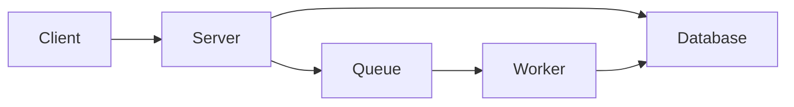

<Note>
MCRIT is a framework created to simplify the application of the MinHash algorithm in the context of code similarity.
</Note>

## What is MCRIT?

MCRIT (MinHash-based Code Relationship & Investigation Toolkit) is a powerful framework for code similarity analysis that enables rapid implementation of "shinglers" - methods that encode properties of disassembled functions for similarity estimation via the MinHash algorithm.

The framework is tailored to work with disassembly reports emitted by [SMDA (Smart Disassembler)](https://github.com/danielplohmann/smda), providing a complete solution for analyzing binary code relationships.

## Key Features

<CardGroup cols={2}>
  <Card title="MinHash Algorithm" icon="fingerprint">
    Fast similarity estimation using MinHash algorithm with customizable shinglers for encoding function properties
  </Card>
  
  <Card title="SMDA Integration" icon="puzzle-piece">
    Native support for SMDA disassembly reports with automatic function analysis and feature extraction
  </Card>
  
  <Card title="Persistent Storage" icon="database">
    MongoDB backend for persistent data storage with efficient querying and indexing capabilities
  </Card>
  
  <Card title="Distributed Architecture" icon="server">
    Server-worker architecture with REST API for scalable processing of matching jobs
  </Card>
  
  <Card title="Python Client" icon="code">
    Comprehensive Python client module with full REST API endpoint coverage
  </Card>
  
  <Card title="CLI Interface" icon="terminal">
    Command-line interface for quick interactions and automation workflows
  </Card>
  
  <Card title="IDA Plugin" icon="plug">
    Integration with IDA Pro for seamless analysis within your reverse engineering workflow
  </Card>
  
  <Card title="Reference Data" icon="book">
    Ready-to-use reference data for common compilers and libraries available via [mcrit-data repository](https://github.com/danielplohmann/mcrit-data)
  </Card>
</CardGroup>

## Use Cases

MCRIT is designed for security researchers and malware analysts who need to:

- **Identify similar functions** across large binary datasets
- **Track code reuse** in malware families and variants
- **Build reference libraries** of compiler-generated code and common libraries
- **Analyze relationships** between different binary samples
- **Label and classify** functions based on similarity matches
- **Detect unique code blocks** for signature generation

## Get Started

<CardGroup cols={2}>
  <Card title="Quickstart" icon="rocket" href="/quickstart">
    Get up and running with MCRIT in minutes using Docker
  </Card>
  
  <Card title="Installation" icon="download" href="/installation">
    Detailed installation instructions for Docker and standalone setups
  </Card>
</CardGroup>

## Architecture Overview

MCRIT consists of three main components:

1. **Server**: REST API interface for submitting samples and querying results
2. **Worker**: Background processing engine for matching jobs and MinHash calculation
3. **Database**: MongoDB instance for persistent storage of samples, functions, and matches

## Version

Current stable version: **1.4.5** (December 2025)

<Warning>
Version 1.3.0 introduced breaking changes with indexing improvements for PicHash and MinHash. When upgrading from earlier versions, recalculation of all hashes is recommended for full backward compatibility.
</Warning>

## License

MCRIT is released under the GNU General Public License v3 (GPLv3).

## Credits

MCRIT is developed by:
- Daniel Plohmann
- Manuel Blatt
- Steffen Enders
- Paul Hordiienko

With special thanks to the community contributors who have helped improve the project!
